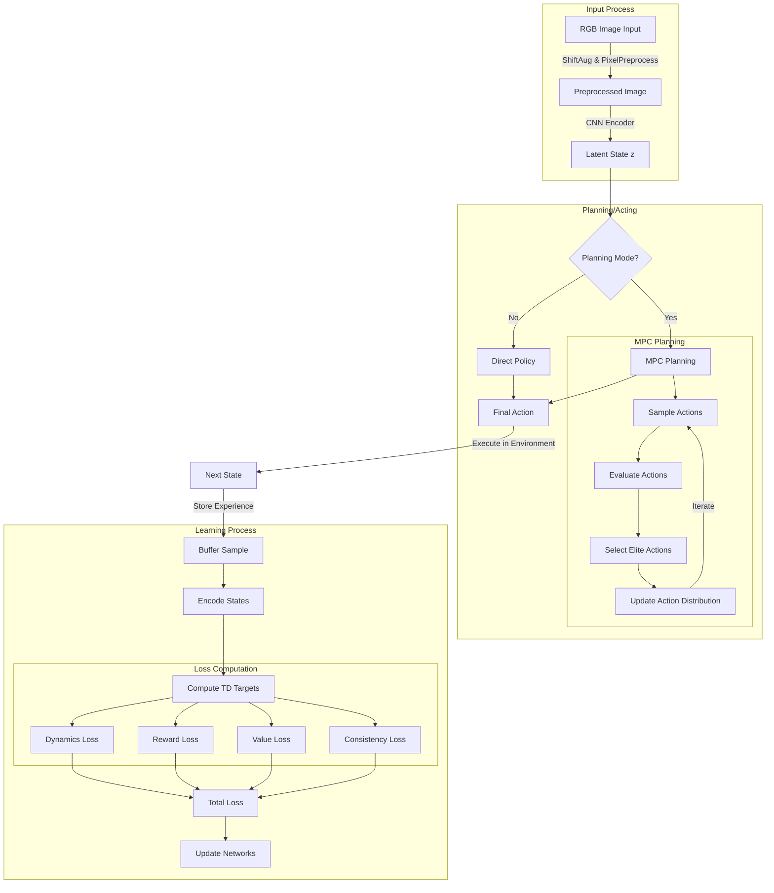

```mermaid

graph TD
    subgraph Input Process
        A[RGB Image Input]
        A -->|ShiftAug & PixelPreprocess| B[Preprocessed Image]
        B -->|CNN Encoder| C[Latent State z]
    end

    subgraph Planning/Acting
        C --> D{Planning Mode?}
        D -->|Yes| E[MPC Planning]
        D -->|No| F[Direct Policy]
        
        subgraph MPC Planning
            E --> G[Sample Actions]
            G --> H[Evaluate Actions]
            H --> I[Select Elite Actions]
            I --> J[Update Action Distribution]
            J -->|Iterate| G
        end
        
        E --> K[Final Action]
        F --> K
    end

    subgraph Learning Process
        L[Buffer Sample] --> M[Encode States]
        M --> N[Compute TD Targets]
        
        subgraph Loss Computation
            N --> O[Dynamics Loss]
            N --> P[Reward Loss]
            N --> Q[Value Loss]
            N --> R[Consistency Loss]
        end
        
        O & P & Q & R --> S[Total Loss]
        S --> T[Update Networks]
    end

    K -->|Execute in Environment| U[Next State]
    U -->|Store Experience| L
    
```